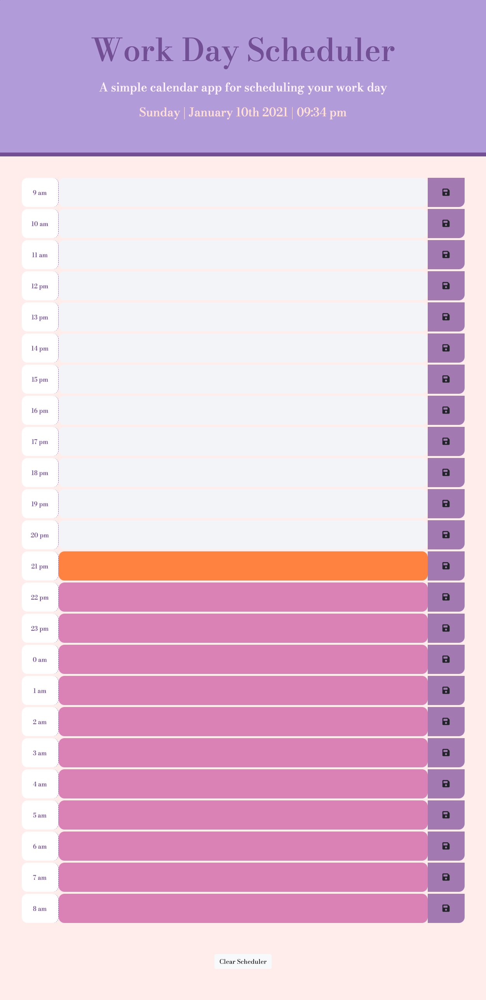
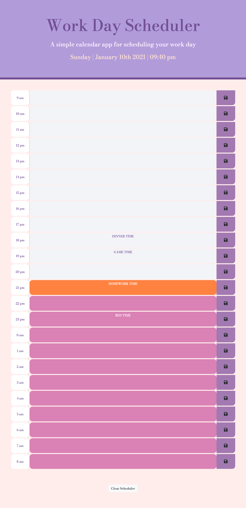

# Work Scheduler
A simple calendar application that allows a user to save events for each hour of the day. 
This app will run in the browser and feature dynamically updated HTML and CSS powered by jQuery.

## Code style
HTML
CSS
jQuery

# Built with
The user arrives at the landing page and is presented with a schedule.

Current day is displayed at the top of the calendar.

Each row will present with time blocks for every hours.(different color indicate the past, present, or future)

User input text into a time block and it's information can be save once the save button was clicked.

User can refresh the page, text for that event is saved in local storage.

User can clear the schedule by simply click on the clear button at the bottom of the webpage.

## Screenshots

# Link to Webpage
[Work Scheduler](https://neeko623.github.io/Work-Scheduler/)